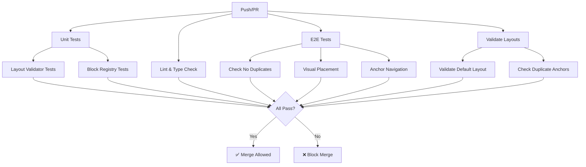

# CI Guardrails - Layout Validation

## Overview

This project uses automated CI checks to prevent layout regressions and ensure blocks are never duplicated across breakpoints.

## What Gets Validated

### 1. Layout Structure (Unit Tests)
**File:** `src/lib/__tests__/layoutValidator.test.ts`

✅ **Checks:**
- No block appears in both `main` and `rail` at any breakpoint
- Singleton blocks (QuickFacts, TOC, etc.) never appear multiple times
- All breakpoints (desktop, tablet, mobile) are defined
- Layout structure is well-formed (arrays in correct places)

❌ **Fails on:**
```typescript
// ❌ WRONG: QuickFacts in both main and rail
desktop: {
  main: ['Hero', 'Bio', 'QuickFacts'],
  rail: ['QuickFacts', 'TOC']  // Duplicate!
}

// ✅ CORRECT: QuickFacts in one location only
desktop: {
  main: ['Hero', 'Bio'],
  rail: ['QuickFacts', 'TOC']
}
```

### 2. Block Registry (Unit Tests)
**File:** `src/lib/__tests__/blockRegistry.test.ts`

✅ **Checks:**
- All blocks have unique anchor IDs
- Widget blocks are marked as singletons
- Content blocks are not singletons
- All blocks have ARIA labels
- Anchor IDs follow conventions (lowercase, kebab-case)

### 3. E2E Tests (Playwright)
**File:** `tests/person-page-no-duplicates.spec.ts`

✅ **Checks:**
- Each block appears exactly once in the DOM at each breakpoint
- Visual placement is correct (rail visible on desktop, hidden on mobile)
- Anchor navigation works across all breakpoints
- ARIA landmarks are present and correct

### 4. Build-Time Validation (Scripts)
**Files:** `scripts/validate-layout.mjs`, `scripts/check-duplicate-anchors.mjs`

✅ **Checks:**
- Default layout configuration is valid
- No duplicate anchor IDs in block registry
- Layout file can be parsed correctly

## Running Checks Locally

### All Tests
```bash
npm run test:unit
```

### Layout Validation Only
```bash
npm run test:unit -- src/lib/__tests__/layoutValidator.test.ts
```

### E2E Tests
```bash
npx playwright test tests/person-page-no-duplicates.spec.ts
```

### Build Scripts
```bash
node scripts/validate-layout.mjs
node scripts/check-duplicate-anchors.mjs
```

## CI Pipeline

The GitHub Actions workflow (`.github/workflows/ci.yml`) runs on every push and pull request:



## Common Failures

### "Block appears in both main and rail"

**Cause:** A block ID is listed in both `main` and `rail` arrays for the same breakpoint.

**Fix:**
```typescript
// Before (❌)
desktop: {
  main: ['Hero', 'Bio', 'QuickFacts'],
  rail: ['QuickFacts', 'TOC']
}

// After (✅)
desktop: {
  main: ['Hero', 'Bio'],
  rail: ['QuickFacts', 'TOC']
}
```

### "Singleton block appears multiple times"

**Cause:** A block marked `singleton: true` appears more than once at a single breakpoint.

**Fix:** Remove one instance - singletons can only appear once per breakpoint.

### "Duplicate anchor IDs found"

**Cause:** Two blocks have the same `anchorId` in `blockRegistry.ts`.

**Fix:** Change one of the anchor IDs to be unique:
```typescript
// Before (❌)
Bio: { anchorId: 'bio', ... },
BioOverview: { anchorId: 'bio', ... }  // Duplicate!

// After (✅)
Bio: { anchorId: 'bio', ... },
BioOverview: { anchorId: 'bio-overview', ... }
```

### "Missing required breakpoint"

**Cause:** Layout map doesn't define all three breakpoints.

**Fix:** Ensure `desktop`, `tablet`, and `mobile` are all present:
```typescript
const layout: LayoutMap = {
  desktop: { main: [...], rail: [...] },
  tablet: { main: [...], rail: [...] },
  mobile: { main: [...], rail: [] }
}
```

## Skipping Checks (Not Recommended)

To skip CI checks temporarily (emergency fixes only):

```bash
git commit -m "fix: emergency patch [skip ci]"
```

**Warning:** This bypasses all validation. Only use for critical hotfixes.

## Adding New Blocks

When adding a new block, ensure you:

1. **Register it in `blockRegistry.ts`:**
```typescript
MyNewBlock: {
  id: 'MyNewBlock',
  type: 'my_block',
  singleton: false,  // or true for widgets
  displayName: 'My New Block',
  category: 'content',  // or 'widget'
  anchorId: 'my-block',
  ariaLabel: 'My new block section'
}
```

2. **Update default layout if needed:**
```typescript
// src/config/personPageLayouts.ts
export const DEFAULT_LAYOUT_MAP = {
  desktop: {
    main: ['Hero', 'Bio', 'MyNewBlock'],  // Add here
    rail: [...]
  },
  // ...
}
```

3. **Run tests:**
```bash
npm run test:unit
npx playwright test
```

## FAQ

### Q: Why do tests fail when I add the same block to desktop and tablet?
**A:** This is allowed! Blocks can appear at multiple **breakpoints**. They just can't appear in both `main` and `rail` at the **same** breakpoint.

### Q: Can I have multiple Bio blocks on a page?
**A:** Yes! Content blocks (Bio, Timeline, Stories) are not singletons and can appear multiple times if needed.

### Q: Can I have multiple QuickFacts?
**A:** No. QuickFacts is a singleton and can only appear once per breakpoint.

### Q: What if I need to bypass validation for a special case?
**A:** Don't. The validation rules are in place to prevent bugs. If you have a legitimate use case, discuss it with the team and update the rules properly.

## Resources

- **Architecture:** `src/components/person-page/ARCHITECTURE.md`
- **Test README:** `tests/README.md`
- **Playwright Docs:** https://playwright.dev/
- **Vitest Docs:** https://vitest.dev/
