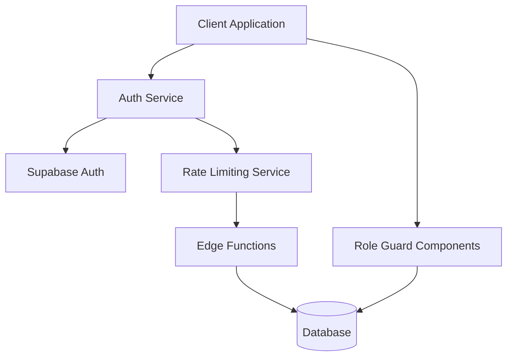
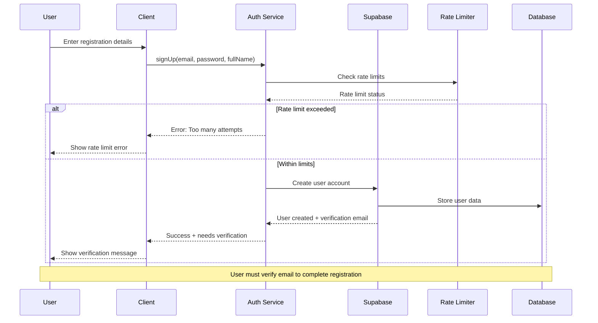
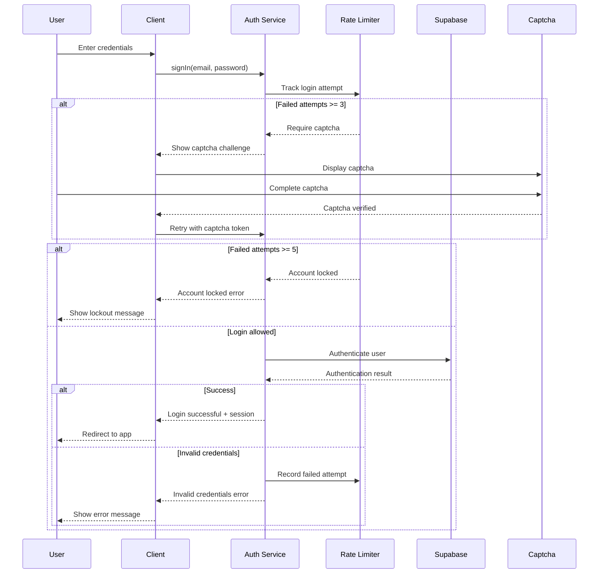
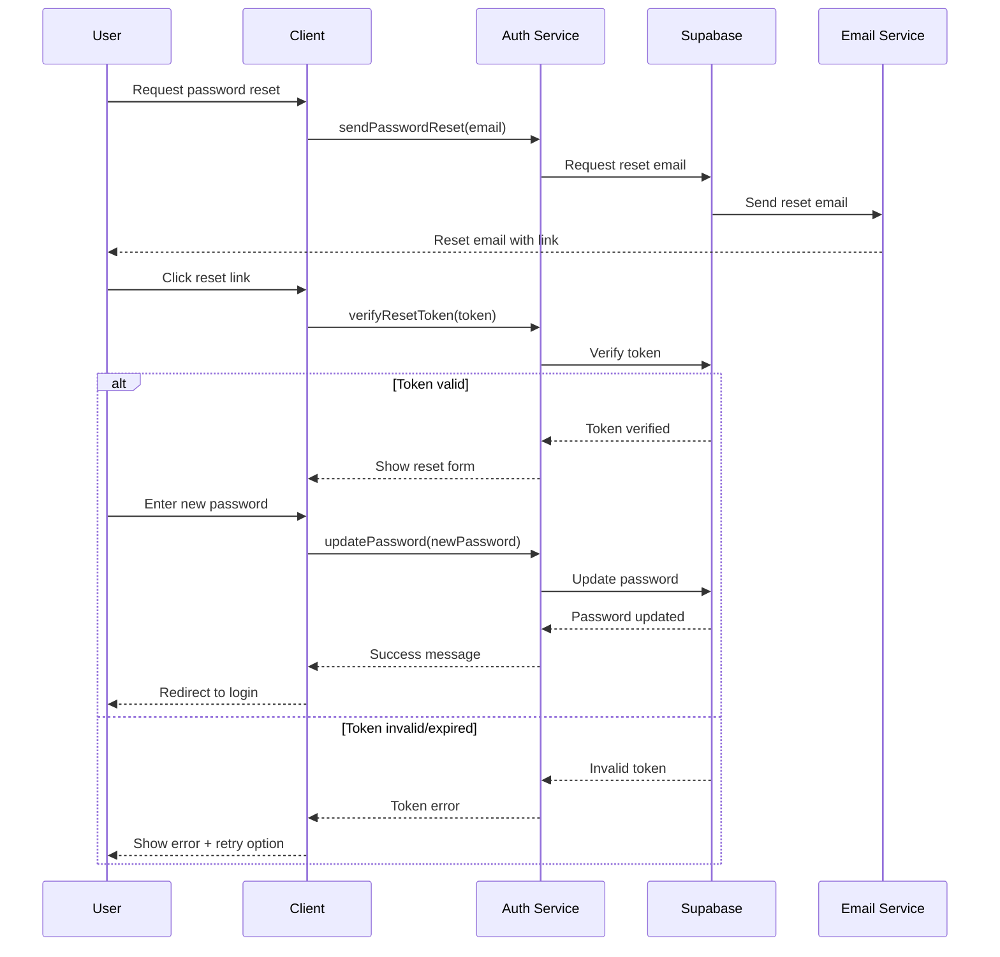
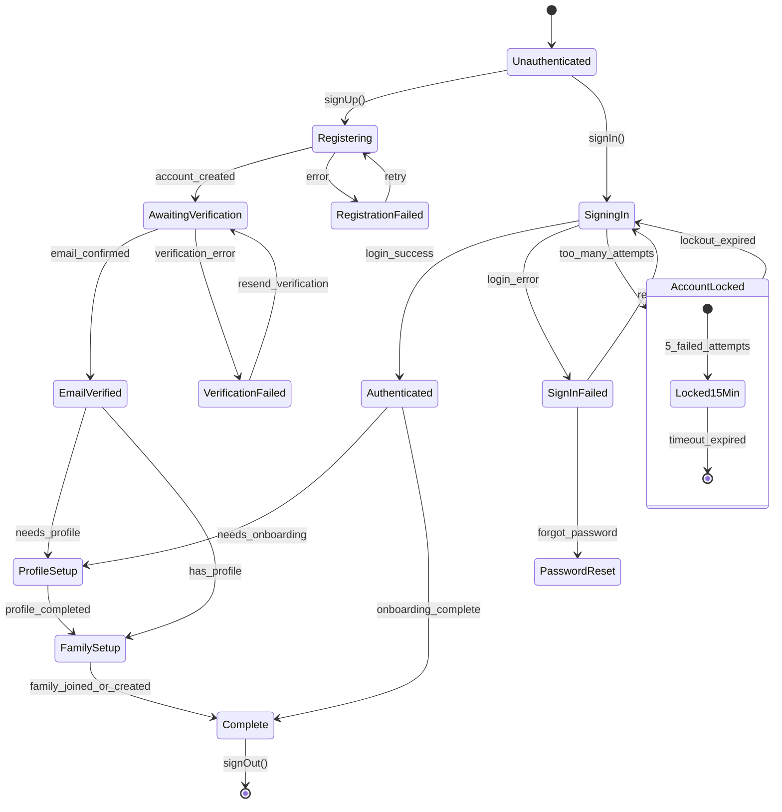
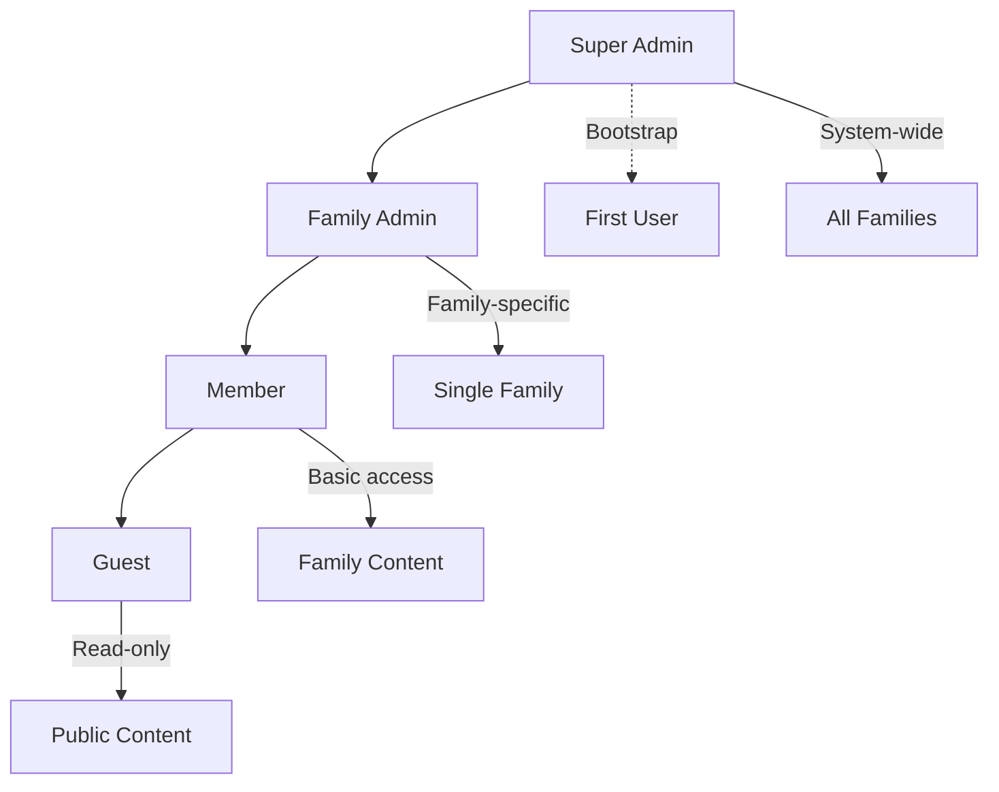

# Authentication System Documentation

## Overview

This document describes the comprehensive authentication system implemented for the application, including multi-phase security enhancements, rate limiting, role management, and user experience optimizations.

## Table of Contents

1. [System Architecture](#system-architecture)
2. [Authentication Flows](#authentication-flows)
3. [Error Handling](#error-handling)
4. [Rate Limiting & Security](#rate-limiting--security)
5. [Role Management](#role-management)
6. [Configuration](#configuration)
7. [Testing](#testing)
8. [Route Protection Guide](#route-protection-guide)

## System Architecture

### Component Overview



### Key Components

- **AuthService**: Centralized authentication operations with error handling and timeout management
- **AuthProvider**: React context providing authentication state across the application
- **SecureRoleGuard**: Database-verified role-based access control
- **Rate Limiting**: Edge function-based protection against abuse
- **Captcha Integration**: Progressive challenge system for suspicious activity

## Authentication Flows

### User Registration Flow



### User Login Flow



### Password Reset Flow



### Onboarding State Chart



## Error Handling

### Error Taxonomy

| Error Type | Code | Description | User Action | Technical Resolution |
|------------|------|-------------|-------------|---------------------|
| **Network Errors** |
| `network_error` | NET001 | No internet connection | Show retry button | Retry request when online |
| `timeout_error` | NET002 | Request timed out (>10s) | Show timeout message + retry | Implement exponential backoff |
| `server_error` | NET003 | Server unavailable (5xx) | Show maintenance message | Check server status |
| **Authentication Errors** |
| `invalid_credentials` | AUTH001 | Wrong email/password | Clear password field | Track failed attempts |
| `user_not_found` | AUTH002 | Email not registered | Suggest sign up | Show registration link |
| `email_not_confirmed` | AUTH003 | Email needs verification | Show resend button | Resend verification |
| `account_locked` | AUTH004 | Too many failed attempts | Show unlock time | Wait for cooldown |
| `weak_password` | AUTH005 | Password too simple | Show requirements | Enforce password policy |
| `email_taken` | AUTH006 | Email already registered | Suggest sign in | Show login link |
| **Rate Limiting Errors** |
| `rate_limit_error` | RATE001 | Too many requests | Show cooldown timer | Implement backoff |
| `captcha_required` | RATE002 | Suspicious activity | Show captcha | Complete challenge |
| `ip_blocked` | RATE003 | IP temporarily blocked | Contact support | Manual review |
| **Validation Errors** |
| `invalid_email` | VAL001 | Malformed email address | Highlight field | Re-enter email |
| `password_too_short` | VAL002 | Password < 6 characters | Show character count | Increase length |
| `missing_required_field` | VAL003 | Required field empty | Highlight field | Fill required data |
| **Session Errors** |
| `session_expired` | SESS001 | Auth token expired | Redirect to login | Refresh token |
| `invalid_session` | SESS002 | Corrupted session | Clear storage + redirect | Re-authenticate |
| `concurrent_session` | SESS003 | Login from another device | Show session conflict | Choose session |

### Error Handling Implementation

```typescript
// Centralized error mapping
export function mapAuthError(error: any): MappedAuthError {
  const errorMap = {
    'Invalid login credentials': {
      message: 'Invalid email or password',
      type: 'invalid_credentials' as const,
      code: 'AUTH001'
    },
    'Email not confirmed': {
      message: 'Please check your email and click the verification link',
      type: 'email_not_confirmed' as const,
      code: 'AUTH003'
    },
    'User already registered': {
      message: 'This email is already registered. Try signing in instead.',
      type: 'email_taken' as const,
      code: 'AUTH006'
    },
    // ... more mappings
  }
  
  return errorMap[error.message] || {
    message: 'An unexpected error occurred. Please try again.',
    type: 'unknown_error' as const,
    code: 'UNKNOWN'
  }
}
```

## Rate Limiting & Security

### Rate Limiting Strategy

| Event | Threshold | Window | Action | Cooldown |
|-------|-----------|--------|--------|----------|
| Failed Login | 3 attempts | Per email+IP | Require captcha | None |
| Failed Login | 5 attempts | Per email+IP | Lock account | 15 minutes |
| Registration | 3 attempts | Per IP/hour | Require captcha | 1 hour |
| Password Reset | 3 requests | Per email/hour | Block requests | 1 hour |
| Email Verification | 5 resends | Per email/day | Block resends | 24 hours |

### Security Features

1. **Progressive Challenge System**
   - Attempt 1-2: Normal login
   - Attempt 3-4: Captcha required
   - Attempt 5+: Account locked

2. **Lockout Management**
   - Server-side lockout tracking
   - Lockout time stored in database
   - Admin unlock capability

3. **Audit Logging**
   - All authentication events logged
   - IP address and user agent tracking
   - Risk scoring for suspicious activity

### Edge Function Implementation

```typescript
// Rate limiting edge function
export default async function handler(req: Request) {
  const { email, ip } = await req.json()
  const trackingKey = `${email}:${ip}`
  
  // Check existing attempts
  const attempts = await getFailedAttempts(trackingKey)
  
  if (attempts >= 5) {
    return lockAccount(email, '15 minutes')
  } else if (attempts >= 3) {
    return requireCaptcha()
  }
  
  return allowAttempt()
}
```

## Role Management

### Role Hierarchy



### Role Matrix

| Resource | Guest | Member | Family Admin | Super Admin |
|----------|-------|--------|--------------|-------------|
| **Family Content** |
| View public stories | ✅ | ✅ | ✅ | ✅ |
| View family stories | ❌ | ✅ | ✅ | ✅ |
| Create stories | ❌ | ✅ | ✅ | ✅ |
| Edit own stories | ❌ | ✅ | ✅ | ✅ |
| Edit any stories | ❌ | ❌ | ✅ | ✅ |
| Delete stories | ❌ | ❌ | ✅ | ✅ |
| **Family Management** |
| View members | ❌ | ✅ | ✅ | ✅ |
| Invite members | ❌ | ❌ | ✅ | ✅ |
| Remove members | ❌ | ❌ | ✅ | ✅ |
| Change member roles | ❌ | ❌ | ✅ | ✅ |
| Family settings | ❌ | ❌ | ✅ | ✅ |
| **System Administration** |
| View audit logs | ❌ | ❌ | ❌ | ✅ |
| System settings | ❌ | ❌ | ❌ | ✅ |
| User management | ❌ | ❌ | ❌ | ✅ |
| Database access | ❌ | ❌ | ❌ | ✅ |

### Bootstrap Admin Process

The first confirmed user automatically becomes a super admin:

```sql
-- Trigger function for first-user admin bootstrap
CREATE OR REPLACE FUNCTION ensure_first_user_is_admin()
RETURNS trigger AS $$
DECLARE
  user_count INTEGER;
BEGIN
  -- Only run on email confirmation
  IF OLD.email_confirmed_at IS NULL AND NEW.email_confirmed_at IS NOT NULL THEN
    SELECT COUNT(*) INTO user_count FROM auth.users WHERE email_confirmed_at IS NOT NULL;
    
    -- If first user, grant super admin
    IF user_count = 1 THEN
      INSERT INTO profiles (id, settings) VALUES (
        NEW.id, 
        jsonb_build_object('role', 'super_admin', 'bootstrap_admin', true)
      ) ON CONFLICT (id) DO UPDATE SET 
        settings = profiles.settings || jsonb_build_object('role', 'super_admin', 'bootstrap_admin', true);
    END IF;
  END IF;
  RETURN NEW;
END;
$$ LANGUAGE plpgsql SECURITY DEFINER;
```

## Configuration

### Environment Variables

```bash
# Supabase Configuration
VITE_SUPABASE_URL=https://your-project.supabase.co
VITE_SUPABASE_ANON_KEY=your-anon-key

# Rate Limiting
RATE_LIMIT_MAX_ATTEMPTS=5
RATE_LIMIT_WINDOW_MINUTES=15
CAPTCHA_THRESHOLD=3

# Security
AUTH_TIMEOUT_SECONDS=10
SESSION_REFRESH_THRESHOLD=300
PASSWORD_MIN_LENGTH=6

# Email Configuration
EMAIL_VERIFICATION_REQUIRED=true
PASSWORD_RESET_ENABLED=true
RESEND_VERIFICATION_COOLDOWN=60
```

### Supabase Configuration

#### Row Level Security Policies

```sql
-- Users can only update their own profiles
CREATE POLICY "Users can update own profile" ON profiles
FOR UPDATE USING (auth.uid() = id);

-- Only super admins can modify admin roles
CREATE POLICY "Only super admins can modify admin roles" ON profiles
FOR UPDATE USING (
  (id = auth.uid() AND 
   COALESCE(settings->>'role', 'member') = COALESCE((SELECT settings->>'role' FROM profiles WHERE id = auth.uid()), 'member'))
  OR
  (EXISTS (SELECT 1 FROM profiles WHERE id = auth.uid() AND settings->>'role' = 'super_admin'))
);
```

#### Auth Settings

1. **Site URL**: Set to your domain (e.g., `https://yourdomain.com`)
2. **Redirect URLs**: Add all valid callback URLs
3. **Email Templates**: Customize confirmation and reset emails
4. **Provider Settings**: Configure OAuth providers if needed

## Testing

### Test Strategy

Our testing approach covers three levels:

1. **Unit Tests** (Vitest): Services, hooks, and utility functions
2. **Integration Tests** (React Testing Library): Component interactions
3. **End-to-End Tests** (Playwright): Complete user flows

### Running Tests

```bash
# Unit tests
npm run test

# E2E tests
npm run test:e2e

# Run all tests
npm run test:all

# Coverage report
npm run test:coverage
```

### Test Coverage Requirements

- **Services**: 90%+ coverage
- **Hooks**: 85%+ coverage
- **Components**: 80%+ coverage
- **E2E Scenarios**: All critical paths

### Critical Test Scenarios

1. **Authentication Flow**
   - ✅ Successful login/logout
   - ✅ Invalid credentials handling
   - ✅ Email verification process
   - ✅ Password reset flow

2. **Rate Limiting**
   - ✅ Captcha after 3 failed attempts
   - ✅ Account lockout after 5 attempts
   - ✅ Lockout expiration

3. **Security**
   - ✅ Role-based access control
   - ✅ Session timeout handling
   - ✅ CSRF protection

4. **User Experience**
   - ✅ Loading states
   - ✅ Error messaging
   - ✅ Offline handling
   - ✅ Mobile responsiveness

## Route Protection Guide

### Protecting Routes with Authentication

#### Basic Authentication Guard

```tsx
import { AuthGate } from '@/components/auth/AuthGate'

function ProtectedPage() {
  return (
    <AuthGate>
      <div>This content requires authentication</div>
    </AuthGate>
  )
}
```

#### Role-Based Protection

```tsx
import { SecureRoleGuard } from '@/components/admin/SecureRoleGuard'

function AdminPage() {
  return (
    <SecureRoleGuard requiredRole="super_admin">
      <div>Super admin only content</div>
    </SecureRoleGuard>
  )
}
```

#### Family-Specific Protection

```tsx
import { SecureRoleGuard } from '@/components/admin/SecureRoleGuard'

function FamilyAdminPage({ familyId }: { familyId: string }) {
  return (
    <SecureRoleGuard requiredRole="family_admin" familyId={familyId}>
      <div>Family admin content for {familyId}</div>
    </SecureRoleGuard>
  )
}
```

### Route Configuration

```tsx
// App.tsx route configuration
<Routes>
  {/* Public routes */}
  <Route path="/login" element={<Login />} />
  <Route path="/signup" element={<Signup />} />
  
  {/* Protected routes */}
  <Route path="/dashboard" element={
    <AuthGate>
      <Dashboard />
    </AuthGate>
  } />
  
  {/* Admin routes */}
  <Route path="/admin/*" element={
    <SecureRoleGuard requiredRole="super_admin">
      <AdminRoutes />
    </SecureRoleGuard>
  } />
</Routes>
```

### Custom Hooks for Role Checking

```tsx
import { useSecureRoles, useIsSuperAdmin, useIsFamilyAdmin } from '@/hooks/useSecureRoles'

function MyComponent() {
  const { data: roles, isLoading } = useSecureRoles()
  const isSuperAdmin = useIsSuperAdmin()
  const isFamilyAdmin = useIsFamilyAdmin('family-123')
  
  if (isLoading) return <LoadingSpinner />
  
  return (
    <div>
      {isSuperAdmin && <AdminPanel />}
      {isFamilyAdmin && <FamilySettings />}
      <RegularContent />
    </div>
  )
}
```

### Security Best Practices

1. **Never trust client-side role data**
   - Always verify roles against database
   - Use server-side functions for role checks

2. **Implement progressive disclosure**
   - Show appropriate UI based on permissions
   - Hide sensitive actions from unauthorized users

3. **Handle edge cases gracefully**
   - Loading states during role verification
   - Error states for failed permission checks
   - Graceful degradation for network issues

4. **Audit access attempts**
   - Log all permission checks
   - Track unauthorized access attempts
   - Alert on suspicious activity patterns

### Common Patterns

#### Conditional Rendering Based on Roles

```tsx
function NavigationMenu() {
  const { data: roles } = useSecureRoles()
  
  return (
    <nav>
      <Link to="/dashboard">Dashboard</Link>
      {roles?.familyRoles.some(r => r.role === 'admin') && (
        <Link to="/family/settings">Family Settings</Link>
      )}
      {roles?.systemRole === 'super_admin' && (
        <Link to="/admin">System Admin</Link>
      )}
    </nav>
  )
}
```

#### Dynamic Route Protection

```tsx
function ProtectedRoute({ children, requiredRole, familyId }: ProtectedRouteProps) {
  const { data: roles, isLoading } = useSecureRoles()
  
  if (isLoading) return <LoadingPage />
  
  const hasAccess = checkUserPermissions(roles, requiredRole, familyId)
  
  if (!hasAccess) {
    return <AccessDeniedPage />
  }
  
  return <>{children}</>
}
```

---

## Troubleshooting

### Common Issues

1. **"User not authenticated" errors**
   - Check session persistence in localStorage
   - Verify JWT token validity
   - Ensure proper auth state initialization

2. **Role permissions not updating**
   - Clear query cache: `queryClient.invalidateQueries(['secure-roles'])`
   - Check database RLS policies
   - Verify role changes were committed

3. **Rate limiting false positives**
   - Check IP address detection
   - Review rate limit thresholds
   - Clear rate limit cache if needed

### Debug Tools

```tsx
import { RoleDebugDisplay } from '@/components/admin/SecureRoleGuard'

function DebugPage() {
  return (
    <div>
      <RoleDebugDisplay />
      {/* Shows current user roles and permissions */}
    </div>
  )
}
```

For additional support, check the audit logs in the admin panel or contact system administrators.